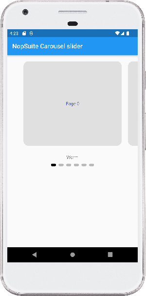
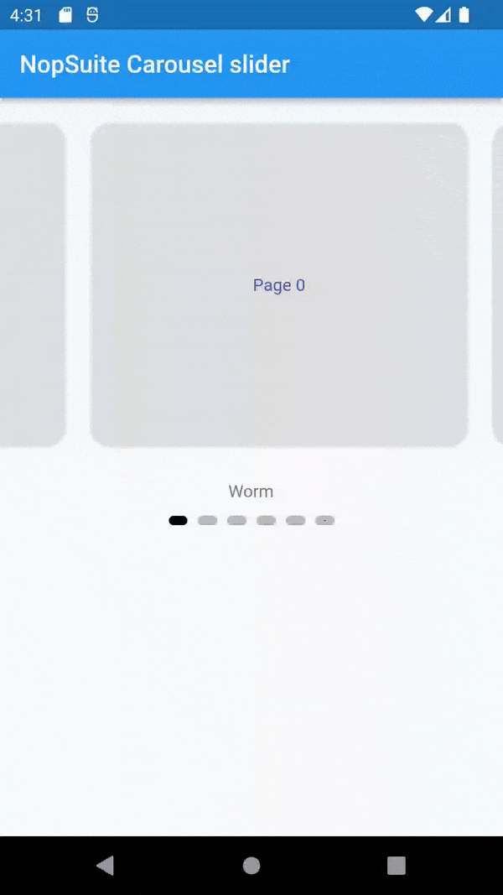

# NopSuite Carousel Slider

## Features

* Infinite scroll
* Custom child widgets

## Supported platforms

* Flutter Android
* Flutter iOS
* Flutter web
* Flutter desktop

## Installation

Add `carousel_slider: ^4.1.1` to your `pubspec.yaml` dependencies. And import it:

```dart
import 'package:nopsuite_carousel_slider/effects/worm_effect.dart';
import 'package:nopsuite_carousel_slider/nopsuite_carousel_slider.dart';
```

# How to Use
```          
 NopSuiteCarouselSlider(
    controller: controller,
    count: pages.length,
    itemBuilder: pages,
    effect: const WormEffect(
      dotHeight: 8,
      dotWidth: 16,
      radius: 4,
      dotColor: Colors.black26,
      activeDotColor: Colors.black,
      type: WormType.normal,
      strokeWidth: 5,
    ),
  )
```
## Screenshot



